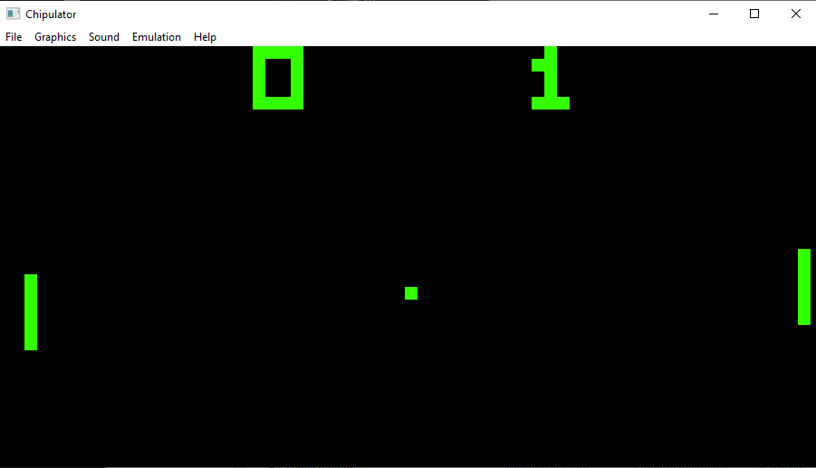

# Chipulator
My attempt at making a Chip-8 emulator/interpreter! Comes with some snazzy tools and options including a memory viewer,
speed controls, and graphics & sound changer. Uses SDL for drawing pixels and generating sound; wxWidgets for UI and event-handling;
and Boost for a little bit of logging.

## CHIP-8
[CHIP-8](https://en.wikipedia.org/wiki/CHIP-8) is an interpreted programming language developed in the 70s. Originally meant for the
home-built microcomputers of the time, CHIP-8 also found a life graphing calculators in the 90s and was expanded with Chip-48 (also called Super-Chip or SCHIP).
Today, CHIP-8 is generally a person's first foray into emulation. A quick search on GitHub will turn up 20 or more different flavors of CHIP-8 emulators/interpreters,
from the fabulous [Octo](https://github.com/JohnEarnest/Octo) to my own Chipulator.  
  
CHIP-8 makes use of 36 instructions to do everything it needs to do and can access up to 4KB of RAM, 16 8-bit registers and 1 16-bit register. The keyboard was hexadecimal,
the display was 64x32 pixels and monochromatic, and the speaker only produces one note. All you need to a good game of Pong! 

You can learn a lot more about CHIP-8 at [Cowgod's Technical Reference](http://devernay.free.fr/hacks/chip8/C8TECH10.HTM#memmap).  

## Installation
Up to now, Chipulator has only tested on Windows machines (although it is theoretically cross-platform). To install,
simply go to the GitHub releases section on the right-hand of the main repository and download the ZIP file there. That contains
the Windows executable and the necessary DLLs, so you can start using Chipulator right away.  

To build on your own, clone the main repository to your machine with:  
`git clone https://github.com/TomRCummings/Chipulator`  
From there you can either use cmake to build with your desired compiler or open the repository folder in Visual Studio and generate the cmake cache from there.

## Controls
The CHIP-8's hexadecimal controller doesn't map very well onto modern keyboards:  
1 2 3 C  
4 5 6 D  
7 8 9 E  
A 0 B F  
Chipulator, by default, maps those controls to their matching keys on your keyboard (i.e. 1 to 1, 2 to 2, etc), but you can change those bindings by going *Emulation*->*Customize Controls*.  

## ROMs
Load a program or game into Chipulator by going to *File*->*Open ROM* and navigating to where ever you have the file saved. The file type largely doesn't matter, but most Chip-8 ROMs you'll have a .ch8 prefix. Chipulator expects ROM files of at most 3584 bytes (program data and code is expected on the RAM from memory location 512 to 4097).
Be sure that, whatever ROM you load, it doesn't contain Super-CHIP instructions.

A huge amount of games, demos, and fun programs exist for the CHIP-8 after the decades it has been around. You'll find a handful of very simple, widely shared
examples in the "roms" folder in the repository and in the release. You can find loads more online, so be sure to explore! Keep in mind that many of the games you'll find are buggy,
but it you do encounter a problem, don't hesitate to report an issue here.

## Reporting bugs
Please report any bugs you may encounter at the [Issues](https://github.com/TomRCummings/Chipulator/issues) page of the project. If you don't have a Github account, feel free to email
your issue to me at cummings dot t287 at gmail dot com. When you report the bug, please include details about your system, what ROM was running at the time, and copy in the text of log.log from
the directory the executable is in. Thank you in advance for helping to make the project better!

## Author
Thomas Cummings  
Contact me: cummings dot t287 at gmail dot com

## MIT License
MIT License

Copyright (c) 2021 Thomas Cummings

Permission is hereby granted, free of charge, to any person obtaining a copy
of this software and associated documentation files (the "Software"), to deal
in the Software without restriction, including without limitation the rights
to use, copy, modify, merge, publish, distribute, sublicense, and/or sell
copies of the Software, and to permit persons to whom the Software is
furnished to do so, subject to the following conditions:

The above copyright notice and this permission notice shall be included in all
copies or substantial portions of the Software.
